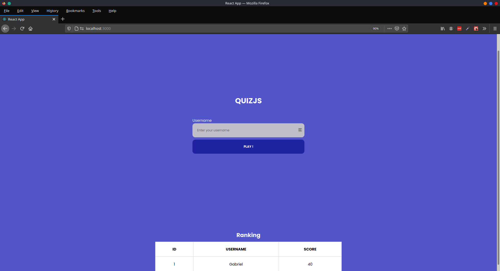
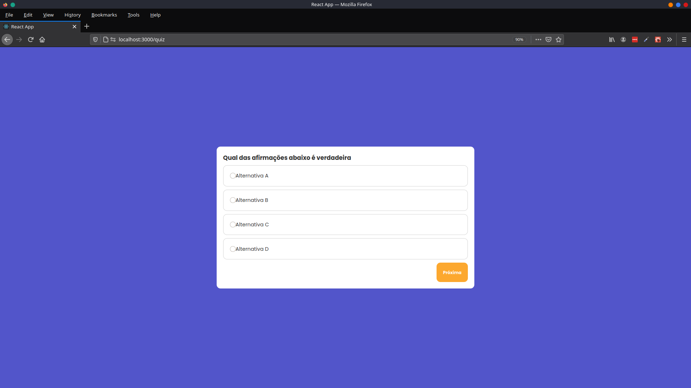

<h4 align="center">
  🚀 QuizJs
</h4>

<p align="center">
 

  
</p>

<p align="center">
  <a href="#computer-tecnologias">Tecnologias</a>&nbsp;&nbsp;&nbsp;|&nbsp;&nbsp;&nbsp;
  <a href="#gear-projeto">Projeto</a>&nbsp;&nbsp;&nbsp;|&nbsp;&nbsp;&nbsp;
  <a href="#layout">Layout</a>&nbsp;&nbsp;&nbsp;|&nbsp;&nbsp;&nbsp;
  <a href="#thinking-como-contribuir">Como contribuir</a>&nbsp;&nbsp;&nbsp;
</p>

<br>


## :computer: Tecnologias

Esse projeto foi desenvolvido com as seguintes tecnologias:

- [Node.js](https://nodejs.org/en/)
- [Express](https://expressjs.com/)
- [React](https://reactjs.org)
- [Knex](http://knexjs.org/)

## :gear: Projeto
O QuizJs é um projeto onde você pode cadastrar questões e criar um quiz com as mesmas. Veja abaixo o endpoint para cadastrar uma questão:
```bash
$ curl --header "Content-Type: application/json" \
  --request POST \
  --data '{       
        "statement":"Questão cadastrada via curl",            
        "alternatives":[
                {"text":"Alternativa A","is_correct":true},
                {"text":"Alternativa B","is_correct":false},
                {"text":"Alternativa C","is_correct":false},
                {"text":"Alternativa D","is_correct":false} 

        ]       
         
  }' \    
  http://localhost:3333/question


```

## Layout

<p align="center">
  
  
</p>

## :thinking: Como contribuir

- Faça um fork desse repositório;
- Cria uma branch com a sua feature: `git checkout -b minha-feature`;
- Faça commit das suas alterações: `git commit -m 'feat: Minha nova feature'`;
- Faça push para a sua branch: `git push origin minha-feature`.

Depois que o merge da sua pull request for feito, você pode deletar a sua branch.


Feito com ♥ by Gabriel Camargo :wave:
